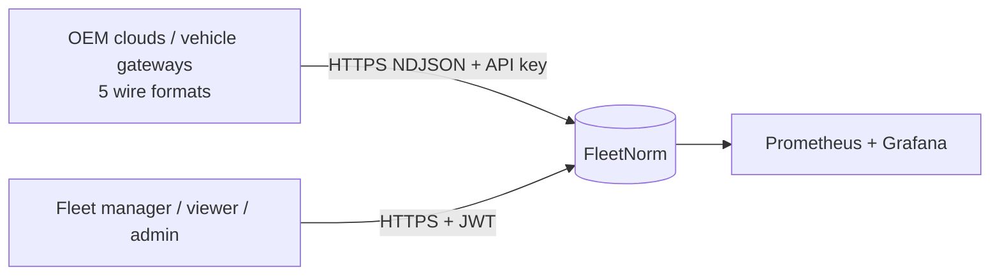
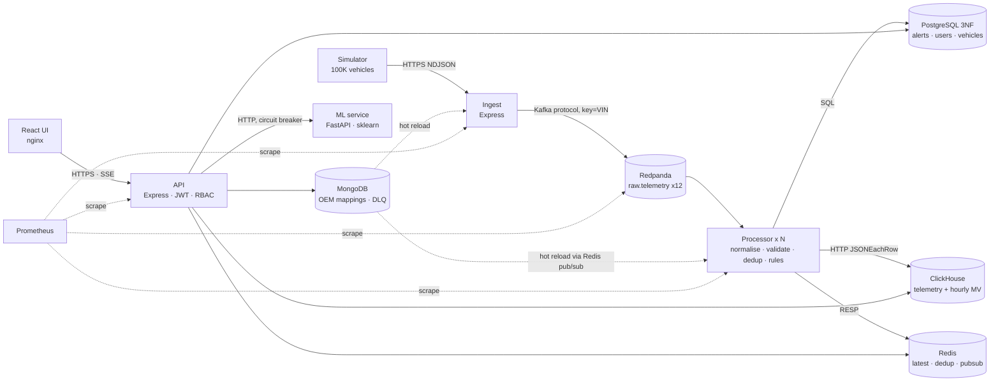

# Architecture

## C4 level 1: context

## C4 level 2: containers

## Data flow of one event (latency budget, to be measured with Grafana `processor_e2e_latency_seconds`)
vehicle → ingest (parse, auth, produce ack) → Kafka → processor batch (normalise, dedup, ClickHouse flush, Redis, rules) → API read (`/vehicles/live`, SSE).

## Layers inside a service (dependency direction ↓ only)
`index.js` (transport: HTTP/Kafka) → `normalise.js` / `rules.js` / `util.js` (pure domain logic, 100% unit-tested, no I/O) → `shared/*` (algorithms, schema, config) → `db.js` (adapters). Domain logic never imports a database client.
