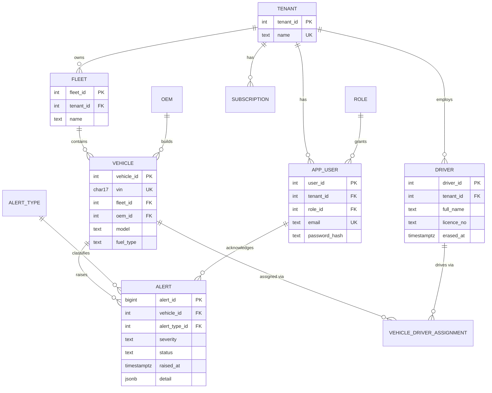

# Relational core (3NF)

**3NF notes.** Every non-key attribute depends on the key only: OEM and role are lookup tables (no repeated strings), a vehicle↔driver many-to-many is resolved by `vehicle_driver_assignment` with history. **Deliberate denormalisation: none in PostgreSQL.** `alert.severity` is an instance attribute (a rule may escalate), not a copy of `alert_type.default_severity`. Tenant scoping is derived through `vehicle → fleet → tenant`, never duplicated on `alert`.
**Audit trail:** `audit_log(tenant, user, action, resource, status, at)` records every `/api` call.
